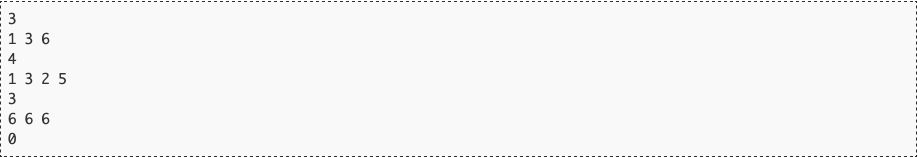
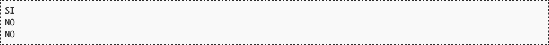

# Saliendo de la crisis

La abeja reina dijo hace unos cuantos meses que la colmena estaba por fin saliendo de la crisis. Ahora Maya quiere comprobar cómo de ciertas eran aquellas declaraciones, así que ha recopilado el histórico de distintos indicadores económicos desde el día de la declaración hasta hoy para ver si, efectivamente, todos ellos han ido creciendo día a día desde entonces.

## Entrada

La entrada estará compuesta de distintos indicadores económicos, cada uno de ellos en dos líneas distintas. La primera línea indica el número de muestras recogidas del indicador (0 < n ≤ 100). La segunda línea contiene n números positivos con los valores económicos (entre 1 y 10.000.000) medidos desde el día de la declaración de la abeja reina hasta el día de hoy.

La entrada termina con un indicador sin muestras (0) que no debe procesarse.

## Salida

Por cada caso de prueba se dirá si según ese indicador la abeja reina tenía razón (SI) o las cosas no están tan bien como ella cree (NO).

## Entrada de ejemplo

## Salida de ejemplo

## Lenguaje empleado

	

---

[🛜 Aquí puedes encontrar el sitio web oficial donde se encuentra este reto.](https://aceptaelreto.com/pub/problems/v002/47/st/statements/Spanish/index.html)